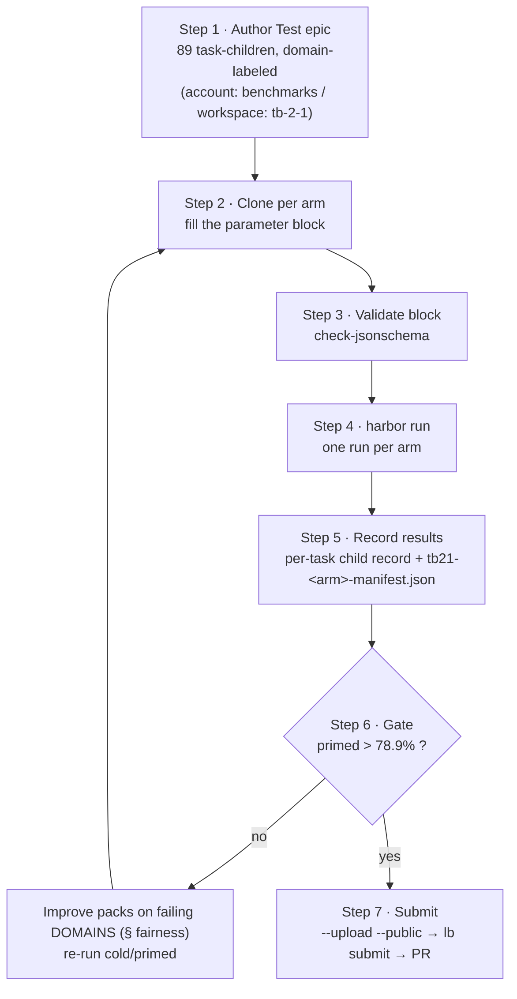

# Terminal-Bench 2.1 — Manual Arm Runbook

How an operator authors and runs one **benchmark arm** end to end. An *arm* is one clone of the
Test epic carrying a [parameter block](arm-params.schema.json) that drives a single `harbor run`.
Every arm — calibration, cold, primed, Fable, submission — is the same shape, so runs are directly
comparable and the process is repeatable for TB 2.2/3.0.

This runbook is self-contained: an operator who has finished the epic **B2 bring-up** can execute it
without any other document. It contains only tables, JSON, bash/CLI, and mermaid — no code.

> **Flag names:** the `harbor run` flags below are the verified subset from the Harbor docs. Exact
> spellings and accepted values can shift between Harbor releases — **confirm with `harbor run --help`**
> before a paid run. Parameters consumed by the *adapter* (not Harbor core) — `reasoning_effort`,
> `priming`, `skill_packs` — are passed through the `sidebutton_harbor_agent` adapter interface; see
> the adapter README for the exact kwarg/env mechanism.

---

## 0. Prerequisites (assume B2 bring-up is done)

| Prerequisite | Check / command |
|---|---|
| Harbor CLI + Daytona extra | `uv tool install "harbor[daytona]"` → `harbor --version` |
| Docker (local smoke sandbox) | `docker run --rm hello-world` |
| Daytona credentials (parallel full runs) | `echo "$DAYTONA_API_KEY"` non-empty |
| Harbor Hub auth (upload target) | `harbor auth login` → `harbor auth status` |
| Dataset pin | note the exact `name@ref` from the dataset's `core/hub.py` (`DATASET@DATASET_REF`) |
| Schema validator | `pipx install check-jsonschema` (or `uv tool install check-jsonschema`) |
| Manifest host (results mirror) | SSH access to `root@46.225.225.112` (`ssh root@46.225.225.112 true`) |
| Oracle smoke passes | `harbor run -a oracle -d <dataset> -l 5 -k 1 --env docker` → oracle solves ≥5 tasks |

If the oracle smoke fails, stop — the harness is not correctly wired and no arm result will be trustworthy.

---

## 1. Overview



Arms in the campaign (each = one clone):

| Clone | Backend | priming | k | packs | upload | Purpose |
|---|---|---|---|---|---|---|
| `calibration` | stock `claude-code`, Opus 4.8 | cold¹ | 1→5 | `[]` | no | Reproduce ~78.9% → prove the harness is wired (floor gate) |
| `sidebutton-cold` | adapter, Opus 4.8 | cold | 5 | `[]` | no | Baseline + per-domain failure taxonomy (drives pack work) |
| `sidebutton-primed` | adapter, Opus 4.8 | primed | 5 | 8 packs | no | **Gate run** — must clear 78.9% before submission spend |
| `primed-fable` *(opt)* | adapter, Fable 5 | primed | 5 | 8 packs | no | Contend the ~83.8% top row |
| `submission` | winning config | as won | ≥5 | as won | **yes** | `--upload --public` → `lb submit` → PR → maintainer re-run |

¹ The calibration arm is *stock* `claude-code`, not our adapter. Represent it as `priming: "cold"`,
`skill_packs: []`, with a bare `agent_import_path` (the Harbor agent name, e.g. `claude-code`). Its point
is the harness floor, not our runtime layer.

---

## 2. The parameter block

One JSON object per arm, validated by [`arm-params.schema.json`](arm-params.schema.json). Fifteen required
fields, `additionalProperties: false`. Reference blocks: [`arm-params.example.json`](arm-params.example.json)
(primed), [`arm-params.cold.example.json`](arm-params.cold.example.json) (cold),
[`arm-params.submission.example.json`](arm-params.submission.example.json) (submission).

| field | type / constraint | notes |
|---|---|---|
| `arm_label` | slug `^[a-z0-9]+(-[a-z0-9]+)*$` | unique arm name, e.g. `sidebutton-primed-opus48` |
| `account` | string (default `benchmarks`) | one benchmark account owns all campaigns |
| `workspace` | slug | `tb-2-1` now; `tb-2-2` / `swe-bench-mm` later |
| `agent_import_path` | `module:Class` **or** bare agent name | adapter `sidebutton_harbor_agent:SidebuttonAgent`; stock arms use `claude-code` |
| `backend_model` | `provider/model` pattern | `anthropic/claude-opus-4-8`, `anthropic/claude-fable-5` |
| `reasoning_effort` | enum `low` / `medium` / `high` | must match the adapter's accepted set |
| `priming` | enum `cold` / `primed` | drives `skill_packs` (see rule below) |
| `skill_packs` | subset of the 8 `sb-tb-*`, unique | `sb-tb-{ml,sci,build,sec,sys,data,algo,git}` |
| `pack_repo_commit` | string | pack-repo SHA at export — recorded so every arm is re-creatable |
| `dataset` | string `name@ref` | pinned dataset, e.g. `terminal-bench/terminal-bench-2-1@v2.1.0` |
| `k_trials` | integer ≥ 1 | calibration 1→5; submission ≥ 5 |
| `sandbox` | enum `docker` / `daytona` / `local` | `docker`/`local` smoke, `daytona` full |
| `concurrency` | integer ≥ 1 | parallel workers, e.g. 16 |
| `include_tasks` | `"all"` **or** array of task names | subset = cheap iteration; submission = `"all"` |
| `upload_public` | boolean | iteration `false`; submission `true` |

**Cold rule (enforced by the schema).** `priming: "cold"` ⇒ `skill_packs: []`; `priming: "primed"` ⇒ at
least one pack. A primed arm with empty packs, or a cold arm with any pack, **fails validation**.

**Submission rule (enforced separately).** A submission arm must be `include_tasks: "all"` × `k_trials ≥ 5`
× `upload_public: true`. This is *not* forced on every arm (calibration/iteration arms are legitimately
smaller) — it is the extra profile in Step 3.

---

## 3. Step 1 — Author the Test epic + 89 task-children

In account `benchmarks`, workspace `tb-2-1`, create the Test epic and **one task-child per TB task**
(89 total), each **labeled by its §7 domain**. The children are the arm's scorecard rows (Step 5).

| Domain (label) | Skill pack | ≈ tasks | Representative tasks |
|---|---|---|---|
| `ml-ai-eng` | `sb-tb-ml` | 16 | `torch-pipeline-parallelism`, `hf-model-inference`, `train-fasttext` |
| `sci-stats` | `sb-tb-sci` | 13 | `mcmc-sampling-stan`, `rstan-to-pystan`, `raman-fitting` |
| `legacy-build` | `sb-tb-build` | 12 | `compile-compcert`, `make-doom-for-mips`, `fix-ocaml-gc` |
| `security-ctf` | `sb-tb-sec` | 10 | `feal-differential-cryptanalysis`, `crack-7z-hash`, `extract-elf` |
| `systems-servers` | `sb-tb-sys` | 10 | `qemu-*`, `nginx-request-logging`, `kv-store-grpc` |
| `data-db` | `sb-tb-data` | 9 | `db-wal-recovery`, `sqlite-*`, `query-optimize` |
| `algorithms` | `sb-tb-algo` | 15 | `winning-avg-corewars`, `regex-chess`, `prove-plus-comm` |
| `git-surgery` | `sb-tb-git` | 4 | `git-leak-recovery`, `sanitize-git-repo`, `fix-git` |
| **total** | | **89** | |

Author this epic **once** as the template; each arm is a clone of it (Step 2). Use the exact TB task
names as child titles — they are what `include_tasks` and `--include-task-name` reference, and what the
per-task record's `task_id` records.

---

## 4. Step 2 — Clone the epic per arm & fill the parameter block

Clone the Test epic for the arm, then author its parameter block. Fill the per-arm columns from the arms
table in §1. Two worked blocks:

**Primed arm** ([`arm-params.example.json`](arm-params.example.json)) — resolve the `pack_repo_commit`
and `dataset` placeholders to the real export SHA and pinned ref before running:

```json
{
  "arm_label": "sidebutton-primed-opus48",
  "account": "benchmarks",
  "workspace": "tb-2-1",
  "agent_import_path": "sidebutton_harbor_agent:SidebuttonAgent",
  "backend_model": "anthropic/claude-opus-4-8",
  "reasoning_effort": "high",
  "priming": "primed",
  "skill_packs": ["sb-tb-ml","sb-tb-sci","sb-tb-build","sb-tb-sec","sb-tb-sys","sb-tb-data","sb-tb-algo","sb-tb-git"],
  "pack_repo_commit": "1a2b3c4d5e6f7a8b9c0d1e2f3a4b5c6d7e8f9a0b",
  "dataset": "terminal-bench/terminal-bench-2-1@v2.1.0",
  "k_trials": 5,
  "sandbox": "daytona",
  "concurrency": 16,
  "include_tasks": "all",
  "upload_public": false
}
```

**Cold arm** ([`arm-params.cold.example.json`](arm-params.cold.example.json)) — same shape, `priming: "cold"`
and `skill_packs: []`:

```json
{
  "arm_label": "sidebutton-cold-opus48",
  "priming": "cold",
  "skill_packs": [],
  "upload_public": false
}
```

Record the `pack_repo_commit` **at export time** (§ pack flow): a mismatch between the packs shipped in
this repo and the recorded commit invalidates the arm.

---

## 5. Step 3 — Validate the parameter block

Every arm — validate against the base schema:

```bash
check-jsonschema --schemafile docs/arm-params.schema.json arm.json
```

Submission arm only — **also** validate the submission profile (all × ≥5 × public):

```bash
check-jsonschema --schemafile docs/arm-params.submission.schema.json arm.json
```

Do not run a paid arm until both applicable checks pass. Sanity-check the schema itself with
`check-jsonschema --check-metaschema docs/arm-params.schema.json`.

---

## 6. Step 4 — Run the arm (`harbor run`)

Parameter → `harbor run` flag (verified subset — confirm exact names with `harbor run --help`):

| param | flag |
|---|---|
| `dataset` | `-d`, `--dataset` `<name@ref>` |
| `backend_model` | `-m`, `--model` `<provider/model>` |
| `agent_import_path` (adapter) | `--agent-import-path` `<module:Class>` |
| `agent_import_path` (stock arm) | `-a`, `--agent` `<name>` |
| `k_trials` | `-k` `<n>` |
| `concurrency` | `--n-concurrent` `<n>` |
| `sandbox` | `--env` `<docker\|daytona>` |
| `include_tasks` subset | `--include-task-name <name>` (repeatable); `-l <N>` limits to the first N |
| `include_tasks: "all"` | omit the include flags |
| `upload_public` | `--upload --public` |
| `reasoning_effort`, `priming`, `skill_packs` | adapter interface (not a Harbor core flag) — see the adapter README |

**Calibration** (stock `claude-code`, floor gate; ramp `-k 1` → `-k 5`):

```bash
harbor run \
  -a claude-code \
  -m anthropic/claude-opus-4-8 \
  -d terminal-bench/terminal-bench-2-1@v2.1.0 \
  -k 5 --n-concurrent 16 --env daytona
```

**Cold** (adapter, no packs — the failure-taxonomy baseline):

```bash
harbor run \
  --agent-import-path sidebutton_harbor_agent:SidebuttonAgent \
  -m anthropic/claude-opus-4-8 \
  -d terminal-bench/terminal-bench-2-1@v2.1.0 \
  -k 5 --n-concurrent 16 --env daytona
  # priming=cold, skill_packs=[] passed through the adapter interface
```

**Primed** (adapter + 8 packs; the gate run) — as cold, with the packs and `priming: primed` supplied to
the adapter. **Subset iteration** while developing packs is cheap — add `-l 5` (first 5 tasks) or repeated
`--include-task-name <task>` and keep `--upload` off.

**Fable** *(optional)*: swap `-m anthropic/claude-fable-5`.

Errored trials count as reward 0 — do not retry-to-green; that is a fairness violation.

---

## 7. Step 5 — Record results

For each of the 89 task-children, write the scorecard record:

```json
{
  "task_id": "torch-pipeline-parallelism",
  "domain": "ml-ai-eng",
  "skill_pack": "sb-tb-ml",
  "trials": 5,
  "reward_mean": 0.80,
  "n_pass": 4,
  "hub_job": "https://hub.harborframework.com/jobs/<uuid>",
  "notes": "hidden test checks gradient-sync correctness across stages"
}
```

Then write the durable per-arm manifest `tb21-<arm>-manifest.json` (mirror of the 89 records for cross-arm
diffing) and copy it to the results host:

```bash
scp tb21-sidebutton-primed-opus48-manifest.json \
    root@46.225.225.112:/root/swebench-results/
```

**Arm score = `mean(reward_mean)` across all 89 children.** The board reports mean reward over ≥5 trials
(not pass@5); the `± x.x%` is trial variance.

---

## 8. Step 6 — Gate

The **primed** arm must clear the primary gate **> 78.9%** (beat validated `Claude Code + Opus 4.8`)
before spending on a submission run. If it does not, do **not** submit:

- read the failure taxonomy at **domain granularity only** (which domains failed — never which tasks,
  never how the oracle solves them);
- improve the corresponding `sb-tb-*` packs against those domains, re-export, bump `pack_repo_commit`;
- re-run cold → primed and re-gate.

| Gate | Target | Meaning |
|---|---|---|
| Floor | reproduce ~78.9% with stock `claude-code` | calibration proves harness correctness |
| **Primary** | **> 78.9%** | beat same-model row → the runtime layer's contribution |
| Stretch | ≈ 83.8% | contend the `Claude Code + Fable 5` top row (Fable arm) |

---

## 9. Step 7 — Submit

Only after the gate clears. The submission arm must satisfy the submission profile (Step 3) and run
stock — **no timeout, resource, or verifier overrides**, exact pinned dataset.

1. Run the winning config with public upload:

   ```bash
   harbor run \
     --agent-import-path sidebutton_harbor_agent:SidebuttonAgent \
     -m anthropic/claude-opus-4-8 \
     -d terminal-bench/terminal-bench-2-1@v2.1.0 \
     -k 5 --n-concurrent 16 --env daytona \
     --upload --public
   ```

2. Submit the uploaded jobs to the leaderboard (filter → metadata → open-prs in one go):

   ```bash
   uv run lb submit https://hub.harborframework.com/jobs/<uuid> [more job links...]
   ```

3. In the PR, include the fairness declaration: packs are domain-general with **zero task-specific
   knowledge**, discovery never read the dataset repo/oracle solutions, verify-loop transparent, stock
   config. A maintainer then comments `/judge` (audit trajectories) and `/apply` (finalize) and merges the
   bot PR to land the row.

**Submission constraints (CI- and reviewer-enforced):**

| Rule | Requirement |
|---|---|
| Task coverage | all 89 tasks, **no cherry-picking** (`include_tasks: "all"`) |
| Trials | **≥ 5 per task**; errored trials = reward 0 |
| Dataset | exact pinned `name@ref` from `core/hub.py` |
| Execution | default settings — no timeout / resource / verifier overrides |
| Upload | `--upload --public` (CI reads everything from Harbor Hub) |
| Packs | public in this repo, domain-general only, no task-id-keyed content |

---

## Cold-arm path (explicit)

The **cold** arm is a first-class path, not an afterthought — it is the honest baseline the whole
pack-improvement loop is measured against:

- parameter block: `priming: "cold"`, `skill_packs: []` (any pack fails schema validation), `upload_public: false`;
- run: adapter via `--agent-import-path`, no packs supplied to the adapter (calibration is the same but with a stock `-a claude-code` agent);
- purpose: produce the per-**domain** failure taxonomy that drives pack work (Step 6). Read failures at
  domain granularity only — reading task-level or oracle detail into the packs is the reward-hacking line
  the campaign must not cross.

Validate a cold block against the schema before running:

```bash
check-jsonschema --schemafile docs/arm-params.schema.json docs/arm-params.cold.example.json
```
